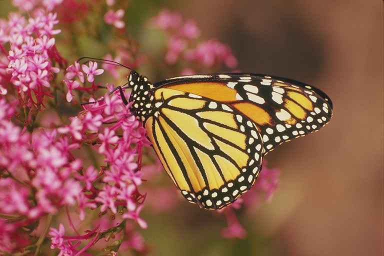
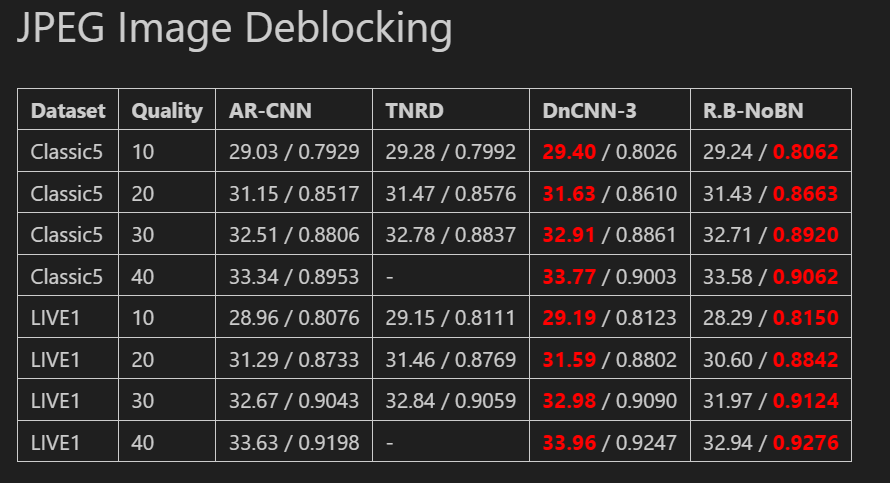
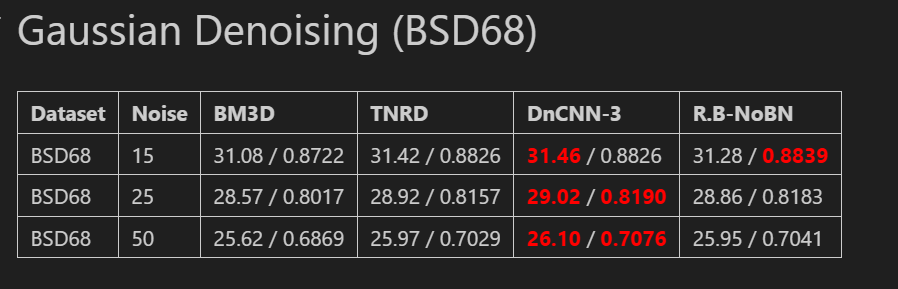
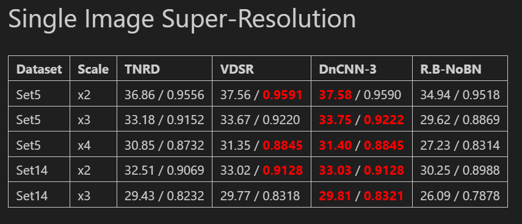

# Deep CNN for Image Denoising

Beyond a Gaussian Denoiser: Residual Learning.

## Structure

```
.
├── config.py      # Baseline + 3 ablation configs
├── model.py       # Model architecture
├── data.py        # Data loading
├── loss.py        # Loss functions
├── metrics.py     # Metrics computation
├── utils.py       # Utilities
├── train.py       # Training script
└── evaluate.py    # Evaluation script
```

## Setup

### Install uv

```bash
curl -LsSf https://astral.sh/uv/install.sh | sh
```

### Create Environment

```bash
uv venv --python 3.11
source .venv/bin/activate  # Linux/macOS
```

### Install Dependencies

```bash
uv pip install -r requirements.txt
```

## Usage

### Training

Run baseline:
```bash
python train.py --images_dir "Data\train" --outputs_dir "logs2"
```

Run ablation experiments:
```bash
python train.py --images_dir "Data\train" --outputs_dir "logs2" --arch "DnCNN-3" --batch_size 16 --num_epochs 50 --lr 0.001 --patch_size 50 --steps_per_epoch 500 --threads 0
```

### Evaluation

```bash
python evaluate.py --dataset_dir "Data\test\BSD68" --weights "logs\DnCNN-3_epoch_50.pth" --task gaussian --sigma 25 --model_output denoised --num_layers 20

python evaluate.py --dataset_dir "Data\test\Set5" --weights "logs\DnCNN-3_epoch_50.pth" --task sr --scale 3 --model_output denoised --num_layers 20

python evaluate.py --dataset_dir "Data\test\classic5" --weights "logs\DnCNN-3_epoch_50.pth" --task jpeg --quality 40 --model_output denoised --num_layers 20
```

## Implementation Guide

1. **config.py**: Define parameters for each ablation
2. **model.py**: Implement your architecture
3. **data.py**: Replace with your dataset
4. **loss.py**: Define custom loss if needed
5. **metrics.py**: Add evaluation metrics
6. **train.py**: Modify training loop if needed

## Ablation Studies

Each ablation config inherits from `BaselineConfig`. Override specific parameters to test:
- Different hyperparameters
- Architectural changes
- Training strategies

Results are tracked automatically in Weights & Biases.

## Results

<table>
    <tr>
        <td><center>JPEG Artifacts (Quality 40)</center></td>
        <td><center><b>DnCNN-3</b></center></td>
    </tr>
    <tr>
    	<td>
    		<center></center>
    	</td>
    	<td>
    		<center></center>
    	</td>
    </tr>
    <tr>
        <td><center>Gaussian Noise (Level 25)</center></td>
        <td><center><b>DnCNN-3</b></center></td>
    </tr>
    <tr>
        <td>
        	<center></center>
        </td>
        <td>
        	<center></center>
        </td>
    </tr>
    <tr>
        <td><center>Super-Resolution (Scale x3)</center></td>
        <td><center><b>DnCNN-3</b></center></td>
    </tr>
    <tr>
        <td>
        	<center></center>
        </td>
        <td>
        	<center></center>
        </td>
    </tr>
</table>


<table>
    <tr>
        <td><center>JPEG Artifacts</center></td>
    </tr>
    <tr>
    	<td>
    		<center></center>
    	</td>
    </tr>
    <tr>
        <td><center>Gaussian Noise </center></td>
    </tr>
    <tr>
        <td>
        	<center></center>
        </td>
    </tr>
    <tr>
        <td><center>Super-Resolution</center></td>
    </tr>
    <tr>
        <td>
        	<center></center>
        </td>
    </tr>
</table>


